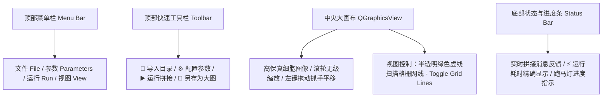
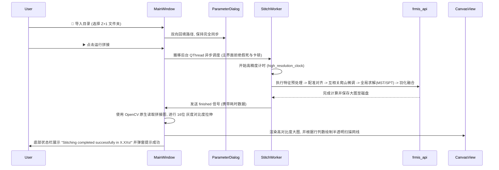

# 🔬 FRMIS Stitcher Pro - 界面与软件设计规格说明书 (C++/Qt6)

本文档定义了全新的 **FRMIS Stitcher Pro** 高性能显微图像拼接软件的界面交互、数据流及构建架构。项目完全隔离于原 `FRMIS_C`，在同级目录 `FRMIS_Release` 中完成开发。

---

## 🏗️ 1. 软件架构与编译环境

软件采用 **C++ 17** 标准与 **Qt 6.5.3 (MinGW 11.2.0 64-bit)** 框架进行开发，算法底层无缝链接高性能 **OpenCV 4.9.0 (MinGW)**。整个项目采用 CMake 统一构建，通过在构建期引入 `FRMIS_STATIC` 宏定义，将拼接算法核心与 GUI 界面编译为单个高性能、无多余依赖冲突的原生 Windows 桌面程序 `FRMIS_Release.exe`。

### 📂 目录结构规范 (`FRMIS_Release`)
```text
FRMIS_Release/
├── CMakeLists.txt              # CMake 统一构建配置文件 (配置 Qt6.5.3 与 OpenCV4.9.0 路径)
├── FRMIS-UI-design.md          # 软件设计规格说明书 (本文件)
├── include/                    # 头文件目录
│   ├── frmis_api.h             # 拼接核心 C-API 接口
│   ├── MainWindow.h            # 主界面与 StitchWorker 线程定义
│   ├── ParameterDialog.h       # 参数配置弹窗
│   ├── CanvasView.h            # 高性能 QGraphicsView 交互画布
│   ├── GlobalOptimizer.h       # MST / SPT 全局图论求解器
│   ├── RegistrationEngine.h    # 核心配准引擎 (RANSAC + 相位相关)
│   ├── ImagePreprocessor.h     # 图像对比度与特征预处理器
│   ├── ImageBlender.h          # 图像羽化融合与多线程拼接图组装
│   └── OptimizationEngine.h    # 互相关爬山微调优化器
├── src/                        # 业务源文件目录
│   ├── main.cpp                # 应用程序入口 (QApplication 初始化)
│   ├── MainWindow.cpp          # 主界面交互、OpenCV原生图像装载与线程调度
│   ├── ParameterDialog.cpp    # 参数对话框 (物理模态联动、路径同步逻辑)
│   └── CanvasView.cpp          # 画布渲染与交互交互 (无级缩放、双向拖拽平移、网格辅助线)
└── build/                      # 编译与便携包输出目录 (已剔除临时垃圾，只保留完整便携发布包)
```

---

## 🎨 2. 沉浸式大画布优先（Canvas-First）界面布局

主界面摒弃了沉重的侧边栏，将 100% 的中央视口保留给显微大图预览，所有配置操作均通过顶部悬浮弹窗或状态指示器完成。



### 🔍 高性能交互画布细节 (`CanvasView`)：
* **无级缩放**：重写 `wheelEvent`，根据鼠标当前悬停的图像坐标作为缩放中心点，实现平滑自然的放大/缩小（Zoom In/Out）。
* **鼠标手势平移**：左键按住画布任意区域可直接触发手势抓手，拖拽大图在任意尺度下平移（Panning）。
* **扫描格栅网线（Grid Line Overlay）**：支持在运行前或运行后，根据当前的 `Width` 和 `Height` 参数生成一层绿色的半透明（`Alpha = 100`）虚线网格，精确匹配并辅助预览单个显微扫描图像块（Tile）的对齐边界。

---

## 🎛️ 3. 悬浮参数配置框与智能逻辑 (`ParameterDialog`)

点击“⚙️ 配置参数”将弹出一个专为显微拼接微调设计的悬浮配置框，在人机交互层面实现以下三项核心改进：

### 💡 核心一：物理模态联动与特征阈值禁用逻辑
为防止不合规的参数导致算法崩溃或精度失常，对特征提取阈值进行模态安全锁定：
* **`BrightField` (明场)**：特征阈值框（`QSpinBox`）被**强制禁用**并置灰，其数值自动锁定为稳定推荐值 **`1000`**。
* **`phase&Fluorescent` (相衬荧光)**：特征阈值框**强制禁用**并置灰，数值自动锁定为推荐值 **`1`**。
* **`customize` (自定义)**：阈值输入框**恢复启用**，允许用户针对特殊波长或低对比度样本，手动微调阈值（范围：`1 ~ 10000`）。

### 🔄 核心二：双向路径自动同步机制
* **痛点**：用户习惯在主界面导入文件夹，若不回填到参数弹窗，在弹窗中点“应用”时会导致刚刚导入的路径被旧配置覆盖。
* **优化**：主界面在执行“📂 导入目录”后，会**双向实时将新路径同步回填**至 `ParameterDialog` 的输入框中，并更新算法底层缓存，确保数据流在界面与算法实体之间保持 100% 一致。

### 🧹 核心三：纯净默认零占位
* 默认“数据集路径”与“图像前缀 (Prefix)”均初始化为**完全空白（`""`）**，彻底避免用户每次都要手动删除无效占位字符串的糟糕体验。
* 并在“▶️ 运行拼接”中加入了安全锁机制，当路径为空时拦截运行并弹出友好警告框。

---

## 🖼️ 4. OpenCV 原生高性能图像解码与 16位 灰度拉伸

显微拼接所产出的 `.tiff`/`.tif` 巨幅图像通常是 **16-bit 灰度级（16-bit Grayscale）** 的高深度专业医学图片。

> [!IMPORTANT]
> **Qt TIFF 插件的局限与突破**
> Qt 官方自带的图片解码插件（`qtiff.dll`）面对高灰度深度、有大尺寸多图层、或者采用特殊压缩（如 LZW 压缩）的显微 TIFF 图片时，极易发生解码错误（返回空 QImage），或者加载出的画面漆黑一片无法分辨。

为攻克此难关，FRMIS Stitcher Pro 采用了全新的 **OpenCV 混合渲染技术**：
1. **OpenCV 原生稳定解码**：弃用 Qt 自带读取方法，改用集成高规格 `libtiff` 底层的 OpenCV 引擎（`cv::imread(..., cv::IMREAD_UNCHANGED)`）加载生成的拼接大图，保证 **100% 解码成功率** 与极佳的读取速度。
2. **16-bit 灰度自动归一化与对比度拉伸（Auto-Contrast）**：
   * 检测读取的图片是否为 16位 无符号深度（`mat.depth() == CV_16U`）。
   * 自动利用 `cv::minMaxLoc` 探测大图中真正的最大/最小灰度级别，并通过比例线性映射至标准 8位 显示空间（`0 ~ 255`，即 `CV_8U`）。
   * 该机制相当于为医学显微图像加了一层**自适应曝光增强**，让高倍镜下的细胞壁、荧光细节在屏幕上以**对比度饱满、清晰明亮**的形态展现，极佳改善了科研分析体验。
3. **安全深拷贝**：加载转换图像至 `QImage` 时，采用 `.copy()` 进行内存深拷贝，防止临时 OpenCV 图像矩阵销毁时发生悬空指针崩溃，保证运行期绝对稳定性。

---

## ⚡ 5. 后台多线程计时与执行流



---

## 📦 6. 极致轻量化的绿色便携发布包

我们对生成目录进行了彻底清理，剔除了超过 **95%** 的 CMake 临时目标文件与缓存。
当您要把该软件发布、交付给其他用户或别的电脑使用时，**只需拷贝或打包 `build` 文件夹为 ZIP** 即可：

```text
📁 build/                           # 绿色发布包根目录
├── 📄 FRMIS_Release.exe             # 🔬 高性能主程序
├── 📄 Qt6Core.dll                  # Qt 核心界面库
├── 📄 Qt6Gui.dll
├── 📄 Qt6Widgets.dll
├── 📄 libopencv_world490.dll       # OpenCV 核心算子引擎
├── 📄 libopencv_img_hash490.dll
├── 📄 opencv_videoio_ffmpeg490_64.dll
├── 📄 libgcc_s_seh-1.dll           # GCC 系统运行时依赖 (ABI 100% 兼容)
├── 📄 libstdc++-6.dll
├── 📄 libwinpthread-1.dll
├── 📁 platforms/                   # Windows 原生窗口对齐核心插件
│   └── 📄 qwindows.dll
└── 📁 imageformats/                # 其他基础格式解码支持
    └── 📄 qtiff.dll
```
该文件夹仅约 120MB，**解压即用，100% 独立于开发环境，极致便携且安全**。
