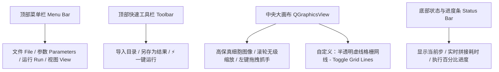
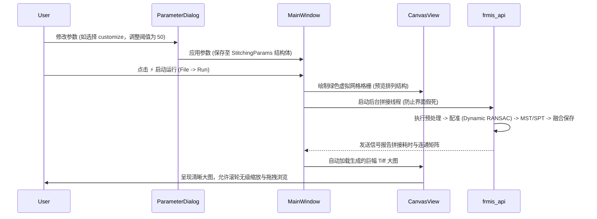

# FRMIS Stitcher Pro - 界面与软件设计规格说明书 (C++/Qt)

本文档定义了全新的 **FRMIS Stitcher Pro** 高性能显微图像拼接软件的界面交互、数据流及构建架构。项目将完全隔离于原 `FRMIS_C`，在同级目录 `FRMIS_Release` 中开发。

---

## 🏗️ 1. 软件架构设计

软件将采用 **C++ 17** 与 **Qt 5.15.2 (MinGW)** 开发，直接与您使用 MinGW 编译的高性能 **OpenCV 4.9.0** 链接。整个项目采用 CMake 统一构建，将算法底层与 GUI 界面无缝编译为单个高性能原生可执行程序 `FRMIS_Release.exe`。

### 📂 目录结构规范 (`FRMIS_Release`)
```text
FRMIS_Release/
├── CMakeLists.txt              # 统一的 CMake 构建配置文件 (配置 Qt5 与 OpenCV4.9.0 路径)
├── include/                    # 头文件目录
│   ├── frmis_api.h             # 拼接核心 API 头文件
│   ├── GlobalOptimizer.h       # 全局图论优化器
│   ├── RegistrationEngine.h    # 核心配准引擎
│   ├── MainWindow.h            # Qt 主窗口类
│   ├── ParameterDialog.h       # 悬浮参数配置窗口类
│   └── CanvasView.h            # QGraphicsView 交互画布类
├── src/                        # 源文件目录
│   ├── main.cpp                # 应用程序入口 (初始化 QApplication 与 MainWindow)
│   ├── MainWindow.cpp          # 主窗口交互逻辑
│   ├── ParameterDialog.cpp    # 参数窗口信号槽逻辑 (含模态控制)
│   ├── CanvasView.cpp          # 高性能画布渲染与交互 (缩放、拖拽、网格)
│   ├── frmis_api.cpp           # 拼接总线业务 (移植优化后的 `-O3` 算法代码)
│   ├── RegistrationEngine.cpp  # 配准引擎 (含移植的 Dynamic RANSAC Early Stopping 算法)
│   ├── GlobalOptimizer.cpp     # MST / SPT 全局求解器 (含连通性指示矩阵传参)
│   ├── ImagePreprocessor.cpp   # 图像预处理
│   ├── ImageBlender.cpp        # 图像惰性懒加载与羽化融合
│   └── OptimizationEngine.cpp  # 互相关位置微调
└── docs/
    └── superpowers/specs/      # 规格说明书存档 (将从 Artifact 目录拷贝过去一份)
```

---

## 🎨 2. 界面布局与视觉规范

主界面摒弃了沉重的侧边栏，采用**“大画布优先（Canvas-First）”**的沉浸式布局，100% 空间保留给显微大图预览。



### 🎛️ 3. 悬浮参数对话框 (`ParameterDialog`) 与交互细节
双击或点击顶部“Parameters”按钮将弹出一个悬浮的独立参数配置对话框。对话框中通过分组框（QGroupBox）规整收纳您所要求的全部算法微调参数。

#### 💡 模态联动与特征阈值禁用逻辑（核心细节）：
根据您最新的代码修改逻辑，参数对话框中实现以下**信号槽联动**：
* 模态选择 `QComboBox` 提供三个选项：`BrightField (明场)`、`phase&Fluorescent (相衬荧光)`、`customize (自定义)`。
* **禁用与自动设值联动**：
  * 当选择 **`BrightField`** 时：特征阈值输入框（`QSpinBox`）被**强行置灰禁用**（`setEnabled(false)`），且数值框强制自动设为 **`1000`**。
  * 当选择 **`phase&Fluorescent`** 时：特征阈值输入框**置灰禁用**，数值强制设为 **`1`**。
  * 当选择 **`customize`** 时：特征阈值输入框**恢复启用**（`setEnabled(true)`），允许用户自由调整数值（如 20、50 等自定义静态阈值）。

---

## 🔄 4. 关键数据流与执行流程



---

## 🧪 5. 验证与测试方案

### 自动验证：
* 验证 C++ 对话框切换 `modality` 时，特征阈值框的 `enabled` 状态和数值是否完美响应。
* 测试拖入畸变、空文件夹以及路径不合规时的错误拦截，确保主程序在报错时弹窗提示，而绝不闪退。

### 手动验证：
* 实际运行一组真实的 $3 \times 3$ 显微图像数据集，在 Qt 中展示大图，使用滚轮放大到像素级，查看是否存在卡顿；查看格栅网线切换是否精确重合。
